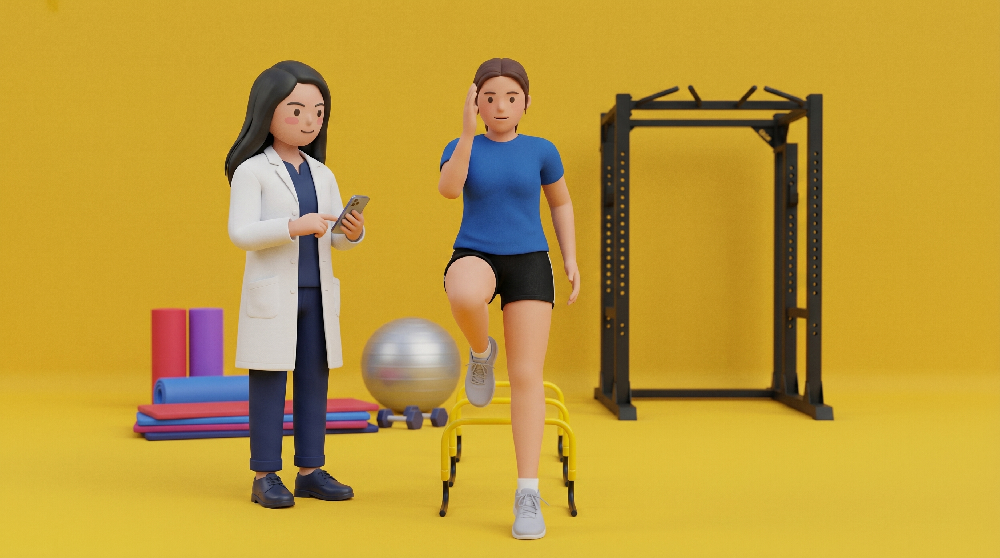

<div align="center">

# BookPhysio.in

**Physiotherapy booking for India** — connect patients with physiotherapists for **in-clinic** and **home-visit** sessions.

[](https://nextjs.org/)
[](https://react.dev/)
[](https://www.typescriptlang.org/)
[](https://tailwindcss.com/)
[](https://supabase.com/)

[Live site](https://bookphysio.in) · [Visual preview](#visual-preview) · [Architecture](#architecture) · [Local setup](#local-development)

</div>

---

## Visual preview

Brand **3D character** assets (homepage hero) and **specialty** illustrations shipped under `public/`. Paths below work on GitHub and locally.

### Characters

<p align="center">
  
  &nbsp;&nbsp;
  
</p>

<p align="center"><sub>Same assets as <code>src/components/HeroSection.tsx</code> · transparent PNGs in <code>public/images/characters/</code></sub></p>

### Specialties

<p align="center">
  
  
  
  
  
  
  
</p>

<p align="center"><sub>Declared in <code>src/lib/specialties.ts</code> · files in <code>public/specialties/</code></sub></p>

---

## Why this repo exists

BookPhysio.in is a full-stack **Next.js App Router** application: public discovery and booking flows, **patient** and **provider** portals, **admin** tools, and **API routes** backed by **Supabase** (Postgres, Auth, storage). The product is tuned for **India** — INR pricing, `+91` phone conventions, and integrations such as **Razorpay** (when enabled), **Resend** for email, and **MSG91**-style SMS templates where applicable.

---

## Features at a glance

| Area | What you get |
|------|----------------|
| **Discovery** | Search, specialty and city landing pages, doctor profiles |
| **Booking** | Multi-step booking wizard, appointments API |
| **Accounts** | Phone OTP and related auth flows (Supabase Auth) |
| **Patient** | Dashboard for appointments, messages, payments UI |
| **Provider** | Portal for availability, patients, messaging |
| **Admin** | Operational dashboards and listings |
| **Quality** | Vitest unit tests, Playwright E2E (`e2e/`), ESLint |

---

## Tech stack

| Layer | Choices |
|--------|---------|
| **Framework** | Next.js 16 (App Router), React 19 |
| **Language** | TypeScript (strict) |
| **UI** | Tailwind CSS v4, shadcn/ui–style primitives, Radix, Lucide |
| **Data & auth** | Supabase (`@supabase/ssr`, `@supabase/supabase-js`) |
| **Validation** | Zod |
| **Payments** | Razorpay (optional / feature-flagged — see `.env.example`) |
| **Email** | Resend |
| **Rate limiting** | Upstash Redis |
| **Tests** | Vitest, Playwright |
| **Deploy** | Vercel (typical) |

---

## Architecture

High-level layout lives in **`docs/CODEMAPS/OVERVIEW.md`**. Use the focused maps when you touch a specific area:

| Doc | Use when |
|-----|----------|
| [`docs/CODEMAPS/pages.md`](docs/CODEMAPS/pages.md) | Routes and layouts |
| [`docs/CODEMAPS/components.md`](docs/CODEMAPS/components.md) | Shared UI |
| [`docs/CODEMAPS/api.md`](docs/CODEMAPS/api.md) | API routes and contracts |
| [`docs/CODEMAPS/lib.md`](docs/CODEMAPS/lib.md) | Clients, validation, utilities |

```
src/app/          → App Router pages (public, patient, provider, admin, api)
src/components/   → Application and shared components
src/lib/          → Supabase clients, Razorpay, validations, helpers
supabase/         → Migrations and Supabase config
e2e/              → Playwright end-to-end tests
```

---

## Local development

### Prerequisites

- **Node.js** (LTS recommended) and **npm**
- A **Supabase** project and keys
- Supporting services as required by your feature (see environment variables)

### Install

```bash
git clone <your-fork-or-remote-url>
cd bookphysio
npm install
```

### Environment

Copy the example file and fill in values:

```bash
cp .env.example .env.local
```

**`scripts/check-env.mjs`** runs on **`prebuild`** and validates required keys. Check configuration anytime:

```bash
npm run check:env
```

> **Tip:** `.env.example` documents each variable — including Supabase, Resend, Upstash, cron secrets, and feature flags like `NEXT_PUBLIC_UI_V2`.

### Common commands

| Command | Purpose |
|---------|---------|
| `npm run dev` | Start the dev server (default: [http://localhost:3000](http://localhost:3000)) |
| `npm run build` | Production build (runs env check first) |
| `npm run start` | Serve production build |
| `npm run lint` | ESLint |
| `npm run type-check` | TypeScript (`tsc --noEmit`) |
| `npm test` | Vitest unit tests |
| `npx playwright test` | E2E tests (app should be running or use your CI setup) |

---

## Product & engineering conventions

- **Currency:** INR (`₹`), integer rupees in product logic — not paise, not USD.
- **Phone:** `+91` display and E.164-style validation patterns as used in app schemas.
- **Design tokens:** See `.claude/design-system/DESIGN.md` and `docs/CODEMAPS/OVERVIEW.md` for palette and UI constraints.
- **Agents / workflow:** Contributor automation and checklists live under **`.claude/`** and **`docs/planning/`** (`ACTIVE.md`, `EXECUTION-PLAN.md`).

---

## Contributing

1. Open an issue or align with maintainers on scope.
2. Branch from **`main`**, keep commits focused, and run **lint**, **type-check**, and **tests** before pushing.
3. Update **CHANGELOG.md** if your contribution follows the repo’s session-handoff protocol (see existing entries for format).

---

## License

No license file is bundled in this repository. If you are not the project owner, **ask the maintainers** before redistributing or reusing this code.

---

<div align="center">

**BookPhysio.in** — *Care that moves with you.*

</div>
